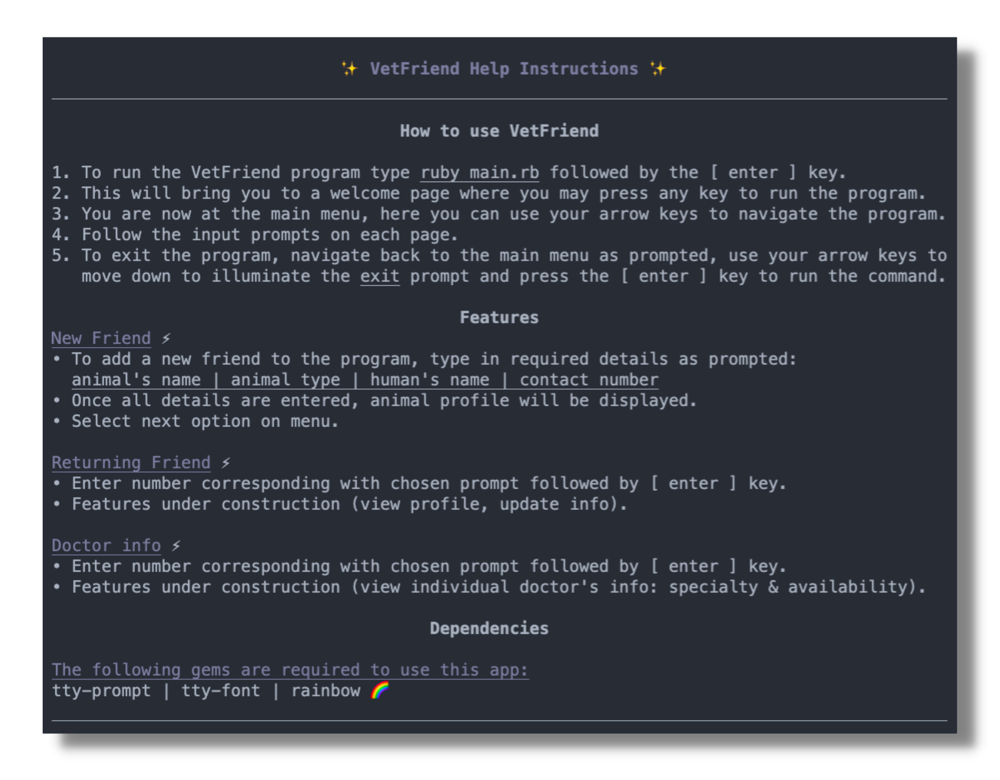

# LILY NOËL • T1A3
### Application Name
- VetFriend

### GitHub Repo
[Lily Noël - T1A3 | GitHub Repository](https://github.com/lilynoel/T1A3)

# App Summary

### Purpose 
VetFriend is a client management terminal based app created for use in a clinical and administrative veterinary setting. 
### Audience 
The intended demographic for this application is veterinary and clerical vet staff. 

###  How To Use 
1. To run the VetFriend program type the following command and hit the [ enter ] key.

            ruby main.rb

2. This will bring you to a welcome page where you may press any key to run the program.

3. You are now at the main menu, here you can use your arrow keys to navigate the program.
   
4. Follow the input prompts on each page.

1. To exit the program, navigate back to the main menu as prompted, use your arrow keys to move down and illuminate the exit prompt. Then simply press the [ enter ] key to run the command.

<u><b>Note</b></u>:
- The user may exit the app at any time using [ ctrl ] + [ c ]
  
###  Features 
The intended use for this application is to output information based on the selected items. VetFriend features navigation options such as, viewing existing client or "Friend" information, adding new client/ "Friend" details and also viewing the doctor information.

Future plans for this app include assigning friends to a doctor based on doctor specialty and animal type. I have high hopes for this app however it is currently unfinished. 

### Walk-through

### Implementation Plan 
The implementation plan for VetFriend was developed using Trello. 
- [Trello | Lily Noël T1A3](https://trello.com/b/Lw1CPssH/t1a3)

### Help Documentation

### Dependencies 
This app has the following dependencies:

- Gem <b>"tty-font"</b>, 0.5.0

- Gem <b>"tty-prompt"</b>, 0.23.1

- Gem <b>"rainbow"</b>, 3.1

### Installation Guide 

1. To use VetFriend, you will need to install the latest version of Ruby. You may need to refer to the Ruby documentation:  [Ruby Installation Guide](https://www.ruby-lang.org/en/documentation/installation/) | [Ruby: Latest Version](https://www.ruby-lang.org/en/)

2. Clone this repository to your computer. 

3. Once you have the latest version of Ruby installed and have cloned this repository to your computer you can install all of this app's dependencies using the following bash script from the src folder:
        
         ./install.sh

4. To run the app, use this command:
            
        ruby main.rb

<u><b>Note</b></u>:
        - alternatively, you can manually install each gem using the commands below once you are within the src folder:

        gem install bundler 

        bundle install 

        gem install tty-font

        gem install tty-prompt

        gem install rainbow

### Et Voila! ✨
 

 
 

